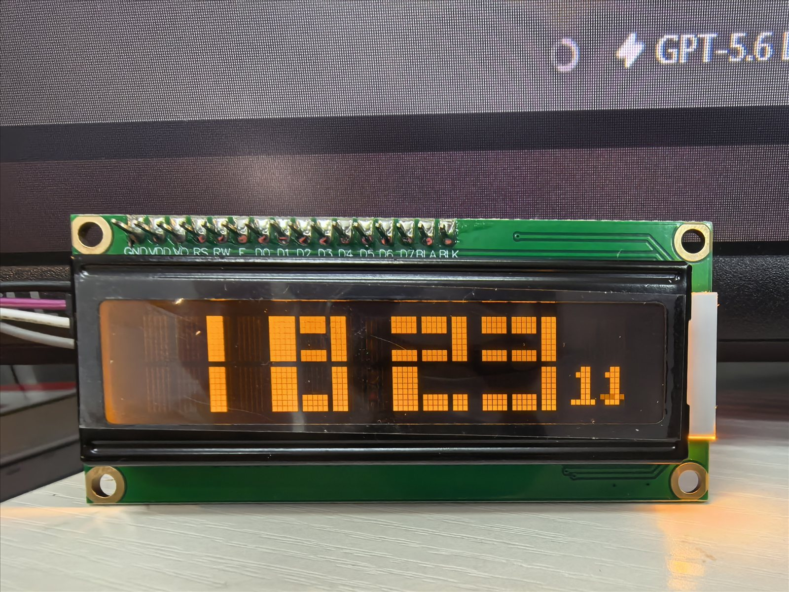
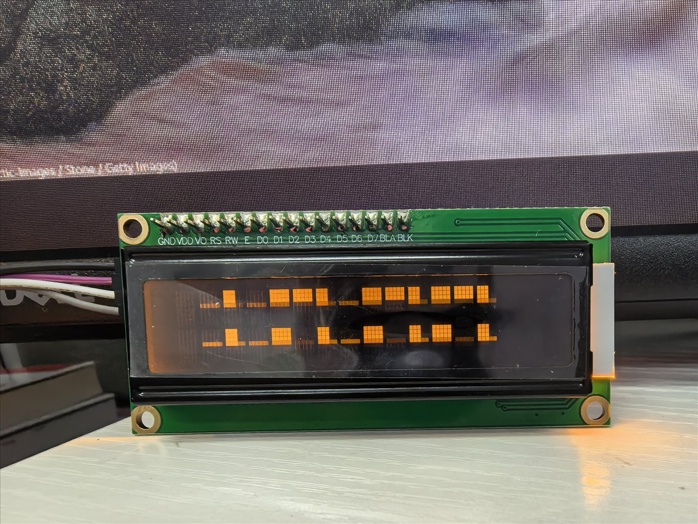

# ESP32-C3 LCD1602 Pixel-Scan Network Clock

[English](#english) · [中文](#中文)



**图 1 / Figure 1 — 正常时钟显示 / Normal clock display.** 3×2 字符大号
`HH:MM` 位于左侧，右下角为两位自定义秒数字形。The 3×2-character large
`HH:MM` occupies the left side, with two custom second digits at the lower right.



**图 2 / Figure 2 — 像素扫描线刷新 / Pixel-scan transition.** 分钟变化时，
上下两个 5×8 字符行中的全亮扫描线同步向下移动，并在扫描线上方逐行显现新时间。
On a minute change, a full-width pixel line moves downward through both 5×8
character rows while the new time is revealed above it.

## 中文

这是一个面向 ESP32-C3、HD44780 LCD1602 和 PCF8574T I²C 背包的 Arduino 网络时钟。
它使用 LCD1602 仅有的 8 个 CGRAM 字符绘制双行大号 `HH:MM`，并在右下角显示两位
科幻风格秒数。时间变化时，字模内部会出现从上向下移动的单像素全亮扫描线。

### 功能

- 3×2 字符的大号 `HH:MM`，以及可选的两位秒数。
- 分钟变化时双字符行同步进行 8 帧像素扫描；秒数字也有独立扫描动画。
- 支持普通 2.4 GHz WPA2-Personal。
- 支持 WPA2-Enterprise PEAP/MSCHAPv2、ESP-IDF 默认 CA 包和严格服务器域名验证。
- 使用三个 NTP 服务器，按 `CST-8` 换算为中国标准时间。
- 断网后继续走时并在后台限速重连。
- 首次联网前使用编译时间或 Flash 中保存的可信时间，避免证书校验与授时互相依赖。
- 自带针对常见 `P0=RS, P1=RW, P2=EN, P3=背光, P4–P7=D4–D7` 背包的轻量驱动，
  不需要安装额外 LCD 库。

### 硬件与接线

| PCF8574T LCD1602 | ESP32-C3 |
|---|---|
| GND | GND |
| SDA | GPIO8 |
| SCL | GPIO9 |
| VCC | 参见下方安全说明 |

默认地址为 `0x27`。引脚、地址、背光极性和动画速度均可在 `config.h` 修改。

> 很多 LCD 背包会把 SDA/SCL 上拉到 5V，而 ESP32-C3 GPIO 不耐受 5V。LCD 使用 5V
> 供电时，请在 SDA/SCL 上使用双向 I²C 电平转换器，或确认上拉电阻连接到 3.3V。

当前 I²C 设为 250 kHz，以加快 CGRAM 动画。它高于原版 PCF8574T 标称的 100 kHz；
如果出现乱码、花屏或初始化失败，请把 `I2C_CLOCK_HZ` 改回 `100000`。

### Arduino IDE 使用方法

1. 在 Boards Manager 安装 Espressif **esp32 3.3.12**。
2. 选择 `ESP32C3 Dev Module`。
3. 启用 `USB CDC On Boot`；如果菜单提供该项，选择
   `USB Mode: Hardware CDC and JTAG`。
4. 将 `secrets.example.h` 复制为 `secrets.h`，把其中 `YOUR_...` 提示占位符替换为
   自己的 SSID、密码和 EAP 参数。`secrets.h` 已被 Git 忽略，不要强制提交。
5. 在 `config.h` 选择网络模式：

   ```cpp
   #define NETWORK_MODE NETWORK_MODE_WPA2_PERSONAL
   // 或 / or:
   #define NETWORK_MODE NETWORK_MODE_ENTERPRISE_EAP
   ```

6. 打开 `LCD1602_SJTU_Clock.ino`，编译并上传。

隐藏右下角秒数：

```cpp
#define SHOW_SECONDS 0
```

关闭秒数时，中央冒号恢复为自定义方块字形。启用秒数时，CGRAM 0–5 用于大号数字，
6、7 正常用于秒十位和个位；大字扫描期间秒数暂时隐藏，6、7 临时变成可扫描实心块
和空白区扫描线，动画结束后再安全恢复秒数。

### 网络、证书与时间

企业模式使用 `WiFi.begin(..., WPA2_AUTH_PEAP, ...)` 选择 PEAP/MSCHAPv2。请在
`secrets.h` 中填写认证服务器证书的真实域名；程序不会在 CA 或域名校验失败时降级到
不安全连接，也不会将密码输出到串口。

NTP 首次同步超时为 20 秒，失败后每 5 分钟重试。同步成功后由 ESP32 SNTP 客户端
按其默认周期自动校时。可信时间最多每 24 小时写入一次 Preferences；ESP-IDF NVS
自带磨损均衡，不会每秒写 Flash。

### 串口诊断

USB 串口会输出 I²C 扫描、LCD 初始化、Wi-Fi、证书域名、IP、NTP 和重连状态，但不会
输出密码。LCD 显示不依赖网络；无 LCD 时出现 `no I2C device found` 是预期行为。

## English

An Arduino network clock for the ESP32-C3, an HD44780-compatible 16×2 LCD,
and a common PCF8574T I²C backpack. It uses all eight CGRAM slots to render a
large two-row `HH:MM` clock plus optional sci-fi-style seconds. Digit changes
are revealed by a one-pixel-high scan line moving through each 5×8 cell.

### Features

- Large 3×2-character `HH:MM` display with optional two-digit seconds.
- Eight-frame pixel scan transition for minute and second changes.
- 2.4 GHz WPA2-Personal support.
- WPA2-Enterprise PEAP/MSCHAPv2 with the ESP-IDF default CA bundle and strict
  authentication-server domain verification.
- Three NTP servers with the `CST-8` timezone for China Standard Time.
- Offline clock operation and rate-limited background reconnection.
- Build-time or persisted trusted time prevents a certificate-validation/NTP
  bootstrap loop.
- A small built-in PCF8574T driver for the common
  `P0=RS, P1=RW, P2=EN, P3=backlight, P4–P7=D4–D7` mapping; no LCD library is
  required.

### Hardware

| PCF8574T LCD1602 | ESP32-C3 |
|---|---|
| GND | GND |
| SDA | GPIO8 |
| SCL | GPIO9 |
| VCC | See the voltage warning below |

The default backpack address is `0x27`. Pins, address, backlight polarity, and
animation timing are configurable in `config.h`.

> Many backpacks pull SDA/SCL up to 5 V, while ESP32-C3 GPIOs are not
> 5 V-tolerant. Use a bidirectional I²C level shifter when powering the LCD at
> 5 V, unless the pull-ups are confirmed to connect to 3.3 V.

The project currently runs I²C at 250 kHz for faster CGRAM animation. This is
above the original PCF8574T's specified 100 kHz standard-mode limit. If the
display becomes unstable, set `I2C_CLOCK_HZ` back to `100000`.

### Arduino IDE setup

1. Install Espressif **esp32 3.3.12** from Boards Manager.
2. Select `ESP32C3 Dev Module`.
3. Enable `USB CDC On Boot` and, when available, select
   `USB Mode: Hardware CDC and JTAG`.
4. Copy `secrets.example.h` to `secrets.h`, then replace every `YOUR_...`
   prompt placeholder with your own SSID, passwords, and EAP settings. The
   local file is ignored by Git.
5. Select `NETWORK_MODE_WPA2_PERSONAL` or
   `NETWORK_MODE_ENTERPRISE_EAP` in `config.h`.
6. Open `LCD1602_SJTU_Clock.ino`, compile, and upload.

Set `SHOW_SECONDS` to `0` to hide seconds and restore the custom block colon.
With seconds enabled, CGRAM 0–5 hold the large-number pieces and slots 6–7
hold the second digits. During a minute transition, seconds are hidden and
slots 6–7 temporarily become the animated solid block and blank-cell scan
line; normal second glyphs are restored only after the large display is safe.

### Networking and time

Enterprise mode selects PEAP/MSCHAPv2 through
`WiFi.begin(..., WPA2_AUTH_PEAP, ...)`. Enter the real authentication-server
certificate domain in `secrets.h`. The firmware never falls back to insecure
certificate handling and never prints passwords to USB serial.

Initial NTP synchronization times out after 20 seconds and retries every five
minutes. After synchronization, the ESP32 SNTP client performs its normal
periodic updates. Trusted time is written to Preferences no more than once per
24 hours; ESP-IDF NVS supplies wear levelling.

### Diagnostics

USB serial reports I²C discovery, LCD initialization, Wi-Fi, certificate
domain, IP address, NTP, and reconnection state without printing passwords.
The display works without Wi-Fi, and `no I2C device found` is expected when the
LCD is disconnected.

## License

MIT. See [LICENSE](./LICENSE).
